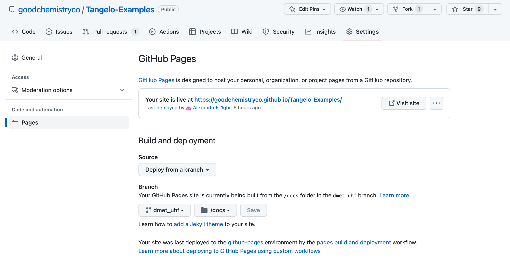

Generate the rendered documentation with Quarto
===============================================

This document is here to assist this project maintainers in updating the `documentation <https://goodchemistryco.github.io/Tangelo-Examples/>`_ of this repository.
Notebooks are rendered using `Quarto <https://quarto.org/>`_, and the source files are deployed via github-pages.
We describe below how to re-generate this documentation after changes in the repository, such as the modification or addition of new notebooks.

1. Installing Quarto
--------------------

The up-to-date information about the Quarto installation can be found in the `installation help <https://docs.posit.co/resources/install-quarto/>`_ and `download <https://quarto.org/docs/download/>`_ webpages.
On Ubuntu (or other Debian-based distributions), the relevant commands can be summarized as

.. code-block::

   # Download the lastest Quarto release
   curl -LO https://quarto.org/download/latest/quarto-linux-amd64.deb

   # The recommended way is to installed it with the Gdebi app
   sudo apt-get install gdebi-core
   sudo gdebi quarto-linux-amd64.deb

2. Updating the documentation
-----------------------------

2a. Updating the relevant files
^^^^^^^^^^^^^^^^^^^^^^^^^^^^^^^

There are two files which may require modifications

- `README.rst`: A README update for users visiting the Github page.
- `index.qmd`:Tthe main page of the rendered documentation, listing and tying together all the other rendered html files.

2b. Regenerate the html files
^^^^^^^^^^^^^^^^^^^^^^^^^^^^^

This is simply done by calling the following command in the root directory of the `Tangelo-Examples` folder.

.. code-block::

   quarto render

Note that all html pages include data about the side menu used to navigate through the website.
As a result, even though you may be only adding or modifying a single file, you may find that all generated files (html, json) have slightly changed as a result.
Please make sure to add, commit and push all modifications, and trust the process.

2c. Deployment on github-pages
^^^^^^^^^^^^^^^^^^^^^^^^^^^^^^

At the time of writing this tutorial, the only way to regenerate the documentation is to manually deploy from the user's branch.
Regenerating this documentation and verifying it works as expected is mandatory before approving and merging a PR that impacts it.
Doing so will however overwrite the existing documentation.
In case the new documentation is not working out and needs further work, please fix it as soon as possible or regenerate from the `main` branch to revert to the previous version: many users depend on it !

|manual_deployment|

